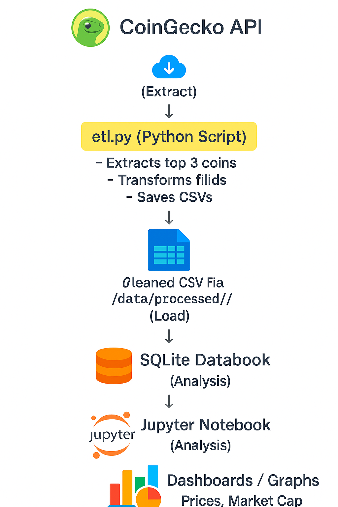

# 🚀 Crypto ETL Dashboard

This is an end-to-end ETL (Extract, Transform, Load) project that collects live cryptocurrency data using the CoinGecko API, stores it in a SQLite database, processes it with Python, and visualizes the data with Matplotlib.

---

## 📌 Features

- 🔄 Automated daily ETL pipeline using Windows Task Scheduler
- 📡 Live crypto price extraction from CoinGecko API (Bitcoin, Ethereum, Dogecoin)
- 🧹 Cleaned and transformed data stored in `crypto_clean.csv`
- 💾 SQLite database (`crypto.db`) for persistence
- 📊 Visualization in Jupyter Notebook using `matplotlib`

---

## 🛠️ Tech Stack

| Component    | Tool              |
|--------------|-------------------|
| Language     | Python            |
| ETL Script   | `etl.py`          |
| Visualization | Jupyter Notebook |
| Database     | SQLite            |
| API Source   | CoinGecko         |
| Automation   | Windows Task Scheduler |

---

## 🗂️ Folder Structure


---

## 📺 Streamlit Dashboard

An interactive dashboard built with Streamlit to explore and visualize the crypto price data dynamically.

### 🔍 Features
- Filter by specific cryptocurrencies
- Toggle between bar, line, and log-scale charts
- View filtered data in an interactive table

### ▶️ How to Run

```bash
pip install -r requirements.txt
streamlit run dashboard.py

📄 **Preview Charts**

- [📊 Bar Chart Preview](Streamlit%20Bar%20chart.pdf)
- [📉 Log Scale Chart Preview](Streamlit%20Log%20Scale%20Bar.pdf)
- [📈 Line Chart Preview](Streamlit%20Line%20chart.pdf)


